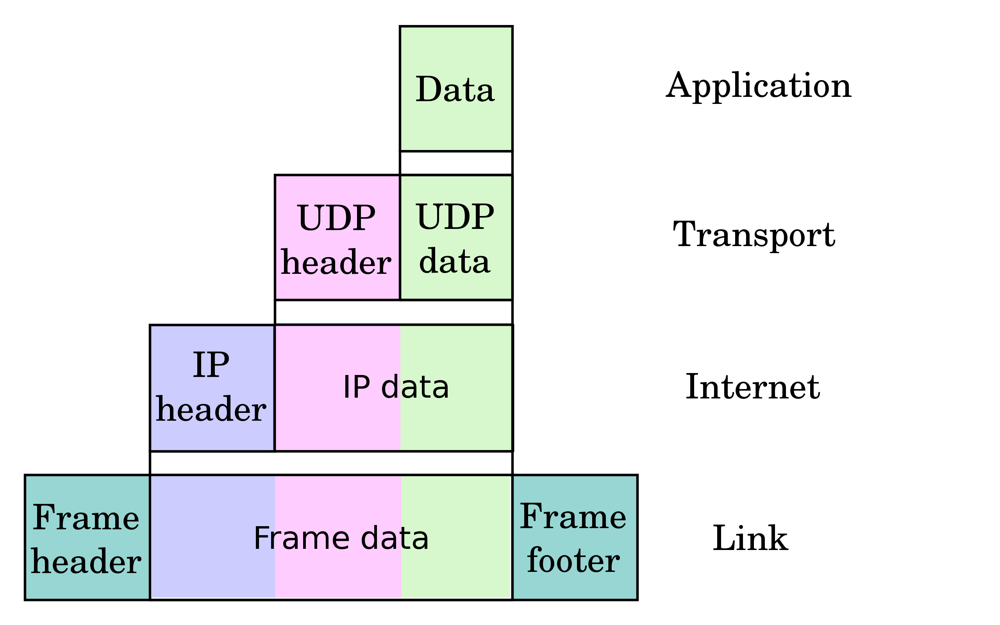

# The Internet

The Internet is the global system of interconnected computer networks that use the Internet protocol suite (TCP / IP) to communicate between networks and devices.

There are many applications basing on the Internet:  
* email, Internet telephony, Internet television, online music, digial newspapers, and video straming websites.
* Blog, web feeds, and online news aggregators.
* Instant messaging, Internet forums, and social networking.
* Online shopping.

## 1. World Wide Web (WWW, The Web)

## 2. HTTP

## 3. Browsers

## 4. DNS & Domain name

## x. Q&A

### x.1 IPv4, IPv6

### x.2 Domain name -> IP address (1:1 or 1:N)

### x.3 Computer network types by spatial scope

* Nanoscale
* Near-field (NFC)
* Body (BAN)
* Personal (PAN)
* Near-me (NAN)
* Local (LAN)
	* Home (HAN)
	* Storage (SAN)
	* Wireless (WLAN)
* Campus (CAN)
* Backbone
* Metropolitan (MAN)
	* Municipal wireless (MWN)
* Wide (WAN)
* Cloud (IAN)
* Internet
* Interplanetary Internet

### x.4 Internet protocol suite

1. Application layer
	* BGP, DHCP, DNS, FTP, HTTP, HTTPS, IMAP, LDAP, MGCP, MQTT, NNTP, NTP, POP, PTP, ONC/RPC, TRP, TRSP, RIP, SIP, SMTP, SNMP, SSH, Telnet, TLS/SSL, XMPP
2. Transport layer
	* TCP, UDP, DCCP, SCTP, RSVP
3. Internet layer
	* IPv4, IPv6, CPMP, ICMPv6, ECN, IGMP, IPsec
4. Link layer
	* ARP, NDP, OSPF< Tunnels (L2TP), PPP, MAC (Ethernet, Wi-Fi, DSL, ISDN, FDDI)

### x.5 User data transfer via the Internet

As user data is processed through the protocol stack, each abstraction layer adds encapsulation information at the sending host. Data is transmitted over the wire at the link level between hosts and routers. Encapsulation is removed by the receiving host. Intermediate relays update link encapsulation at each hop, and inspect the IP layer for routing purposes.

### x.6 Network topology, Data flow

Conceptual data flow in a simple network topology of two hosts (A and B) connected by a link between their respective routers. The application on each host executes read and write operations as if the processes were directly connected to each other by so0me kind of data pipe.  
After establishment of this pipe, most details of the communication are hidden from each process, as the underlying principles of communication are implemented in the lower protocol layers. In analogy, at the transport layer the communication appears as host-to-host, without knowledge of the application data structures and the connecting routers, while at the internetworking layer, individual network boundaries are traversed at each other.

### x.7 DNS analogy

A DNS resolver sonsults three name servers to resolve the domain name user-visible "www.wikipedia.org" to determine the IPv4 address 207.142.131.234.
